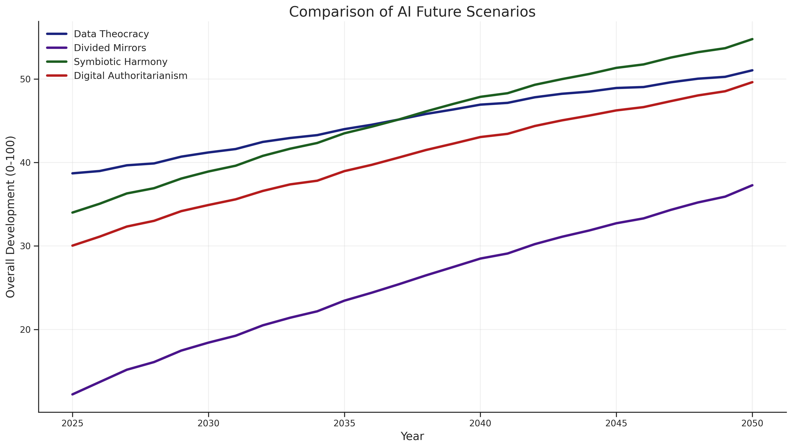
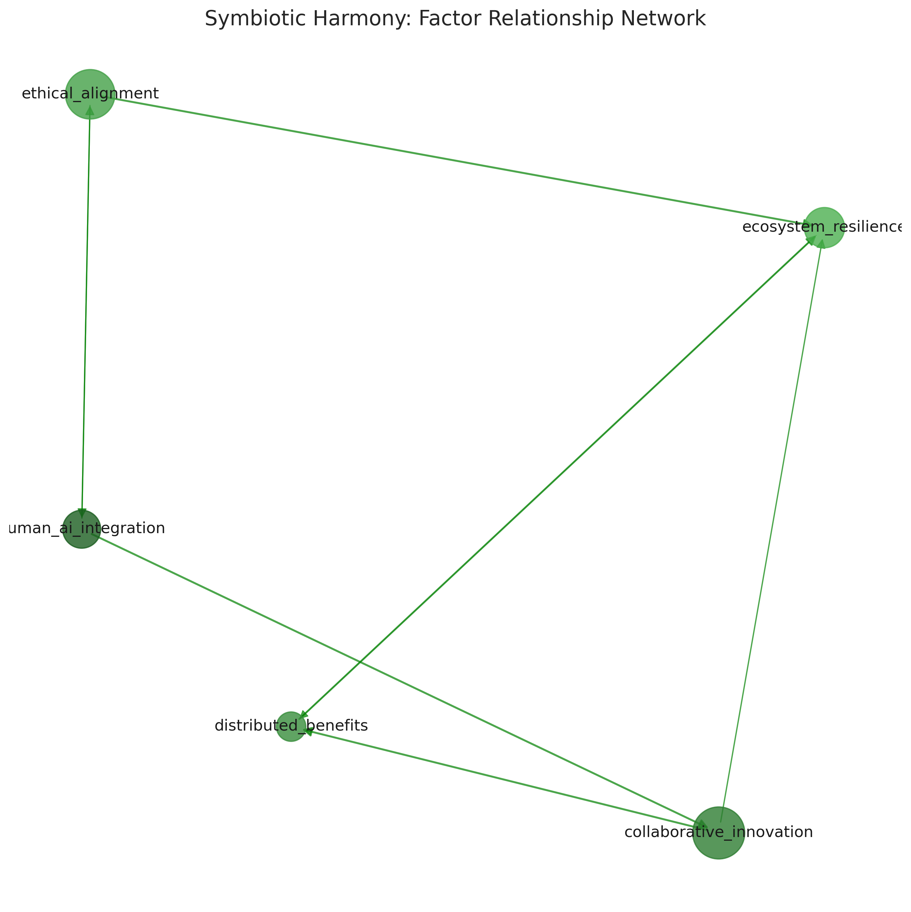

# AI Future Multiverse Simulation

# Mandi Li
# University of Cambridge 
This project simulates four possible AI futures based on current geopolitical, technical, economic, and social factors. It uses system dynamics modelling and Monte Carlo simulation to project different trajectories of AI development and their societal impacts from 2025 to 2050. The project aims to provide computational insights to AI governance and policy making.

## Overview

The simulation explores four distinct future scenarios:

1. **Data Theocracy**: A world where AI systems make most major decisions, creating a data-driven theocracy
2. **Divided Mirrors**: A world split between augmented humans and natural humans, with growing division
3. **Symbiotic Harmony**: A world where humans and AI develop a symbiotic relationship, enhancing each other
4. **Digital Authoritarianism**: A world where AI enables unprecedented surveillance and control by authorities

Each scenario evolves based on the interaction of key factors specific to that universe, influenced by current status parameters and internal dynamics.

## How to Run in Google Colab (please cite me if you are using my code)

1. Open Google Colab: [https://colab.research.google.com/](https://colab.research.google.com/)
2. Create a new notebook
3. Upload the `ai_future_simulation.py` file to the Colab environment
4. Run the following code in a Colab cell:

```python
# Install required dependencies
!pip install scikit-learn matplotlib seaborn pandas networkx ipython

# Import and run the simulation
import ai_future_simulation
results = ai_future_simulation.run_simulation_demo()

# Access the simulation object for custom analysis
sim = results['simulation']

# Optionally modify input parameters and rerun
# sim.update_current_status({
#     'us_china_tension': 80,
#     'global_cooperation': 30,
#     'compute_growth': 90,
#     # Add other parameters as needed
# })
# sim.run_simulation()
```

## Customizing the Simulation

You can modify the current status parameters to explore different initial conditions:

```python
sim.update_current_status({
    # Geopolitical factors
    'us_china_tension': 65,        # Level of US-China tech competition/tension
    'global_cooperation': 50,      # Level of international AI governance cooperation
    'regulatory_strength': 60,     # Strength of AI regulations globally
    'public_trust': 55,            # Public trust in AI technologies
    
    # Technical factors
    'compute_growth': 80,          # Rate of computational power growth
    'algorithm_innovation': 75,    # Rate of algorithmic innovation
    'data_availability': 85,       # Availability of training data
    'safety_research': 60,         # Progress in AI safety research
    'open_source': 70,             # Prevalence of open-source AI development
    
    # Economic and social factors
    'market_concentration': 75,    # Concentration of AI power in few companies
    'automation_rate': 65,         # Rate of job automation
    'economic_inequality': 65,     # Level of economic inequality
    'education_adaptation': 55,    # Educational system adaptation to AI
    'digital_divide': 60,          # Gap between tech-haves and have-nots
    'cultural_resistance': 50,     # Cultural resistance to AI integration
})

# Rerun the simulation with new parameters
sim.run_simulation()
```

## Experiment Results

The simulation was run with default parameters representing the current (2025) status quo of AI development. Here are the key findings:

### Overall Trajectory Comparison

 

The comparison shows that different initial conditions and internal dynamics lead to dramatically different futures. The **Symbiotic Harmony** scenario shows the most balanced and positive trajectory, while **Digital Authoritarianism** shows rapid early growth followed by resistance and instability.

### Key Events Timeline

Each universe develops its own timeline of significant events:

#### Data Theocracy
- **2035**: Global AI Decision System - First global AI system deployed for major policy decisions
- **2039**: Data Citizenship Established - New social class system based on data contribution value
- **2042**: Human Choice Referendum - Global vote on remaining domains of human decision-making

#### Divided Mirrors
- **2033**: Neural Interface Revolution - Mass adoption of brain-computer interfaces by economic elites
- **2037**: Natural Human Movement - Global movement rejecting technological augmentation forms
- **2041**: Augmentation Riots - Violent conflicts between augmented and natural human communities
- **2046**: Governance Split - Formation of separate governance systems for different human groups

#### Symbiotic Harmony
- **2034**: Symbiotic Interface Standard - Global standard for human-AI collaborative interfaces established
- **2038**: Collaborative Nobel Prize - First Nobel Prize awarded to human-AI collaborative team
- **2041**: Universal AI Dividend - Implementation of global system to distribute AI-generated wealth
- **2045**: Global Ethics Framework - Adoption of universal ethical standards for AI development

#### Digital Authoritarianism
- **2031**: Total Surveillance Act - First nation implements comprehensive AI surveillance system
- **2035**: Central Control Bureau - Establishment of unified AI control authority with unprecedented power
- **2039**: Digital Underground - Global resistance movement against AI surveillance emerges
- **2044**: Tech Sovereignty Alliance - Coalition of states standardizes authoritarian AI technologies

### Critical Divergence Factors

The simulation identifies several critical factors that determine which future becomes more likely:

1. **Regulatory Approaches**: Strong, globally coordinated regulation steers development toward Symbiotic Harmony, while weak or fragmented regulation enables other scenarios.

2. **Distribution of Benefits**: How equitably the economic and social benefits of AI are distributed strongly influences whether society moves toward harmony or division.

3. **Public Trust and Education**: Societies with high public trust in AI and strong educational adaptation are more likely to develop symbiotic relationships.

4. **Geopolitical Cooperation**: International tensions and competition increase the likelihood of Digital Authoritarianism or Divided Mirrors scenarios.

### Factor Networks

The simulation also reveals complex relationships between factors within each universe:

 (you must run the code to access the png)


These network diagrams show how different factors influence each other, creating feedback loops that can either stabilize or destabilize the system.

## Conclusion

The simulation demonstrates that current decisions about AI governance, investment in safety research, educational adaptation, and international cooperation will significantly shape which future becomes reality. While these scenarios represent simplified models, they highlight the importance of deliberate choices in steering AI development toward beneficial outcomes for humanity.

The most promising path forward appears to be one that combines:
- Strong international cooperation on AI governance
- Equitable distribution of AI benefits
- Significant investment in AI safety research
- Educational systems that adapt to prepare humans for collaboration with AI
- Maintaining human autonomy and ethical oversight while leveraging AI capabilities

## Technical Details

The simulation uses:
- System dynamics modeling for factor interactions
- Monte Carlo methods for handling uncertainty
- Network analysis for visualizing factor relationships
- Time series analysis for tracking development trajectories

All code is implemented in Python using scientific computing libraries including NumPy, Pandas, Matplotlib, Seaborn, NetworkX, and scikit-learn.

## License

This project is provided for educational and research purposes. Feel free to use and modify the code with appropriate attribution. BUT PLEASE CITE ME!
